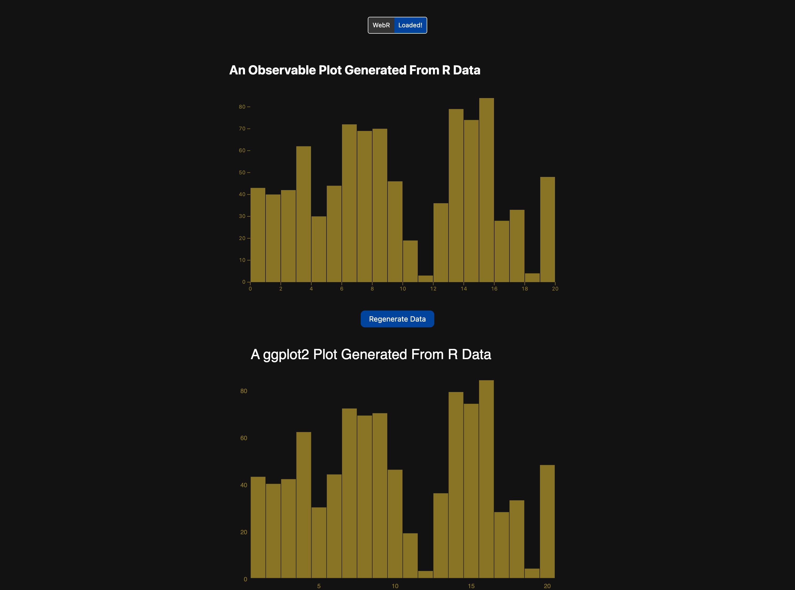
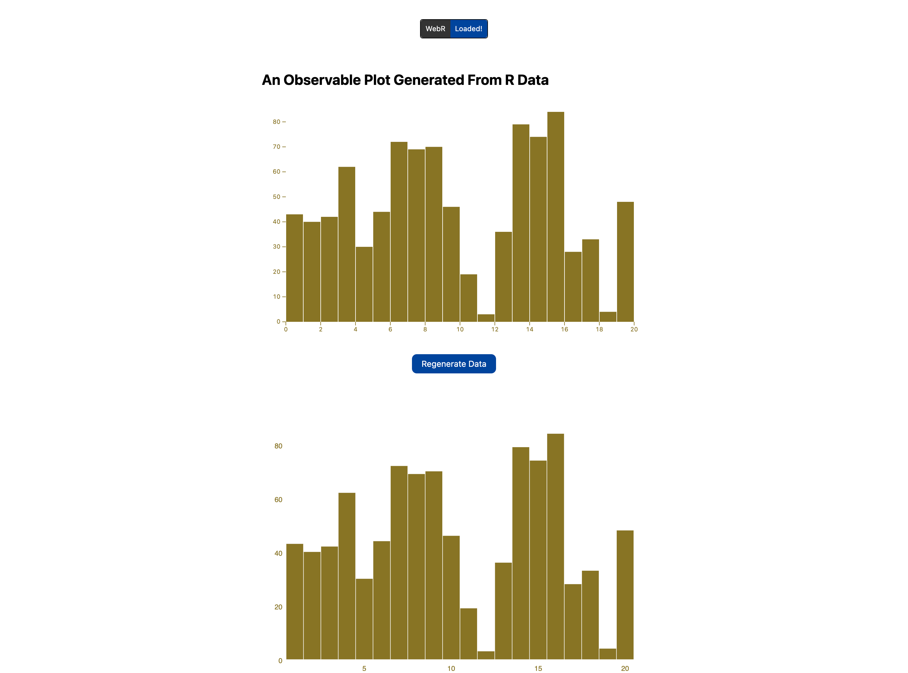

# webr + lit + vite npm template

 







A quick way to start a new WebR project with:

- WebR
  - Comes with an `r.js` that has some batteries included with more on the way
- Pyodide (via CDN; uninitialized; just there if you need it)
- Lit: Three basic components available now, but more coming soon
  - `action-button.js`: a simple button that does what you tell it to when pressed
  - `ojs-plot.js`: a very generic Observable Plot component 
  - `status-message.js`: the "WebR: Loading…/Loaded" thingy, leveled up a bit
- Vite: fast build system
- Light/Dark mode CSS based on [Tachyons](https://tachyons.io/)
- An initial `index.html` that shows off the components and the entire CSS design system

To get started:

```
npx create-webr-vite-lit my-webr-project
```

Initialize it:

```
cd my-webr-project
mv _gitignore .gitignore # i'll eventually do this for you
npm install
```

Test!

```
npx vite --port=4000
```

